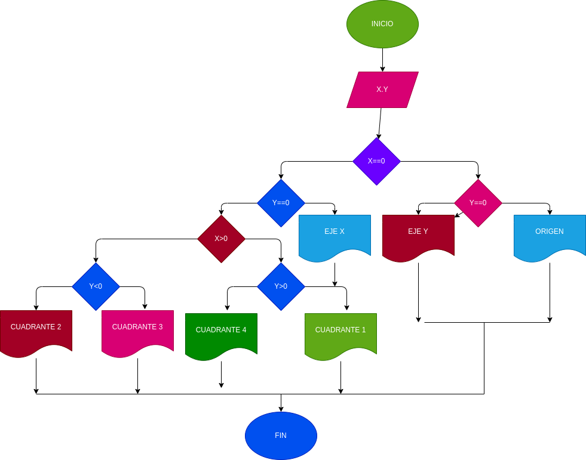

# Ejercicio N.1

## Programa que lea las coordenadas cartesianas (x, y) de un punto en el plano y calcule el cuadrante al cual pertenece el punto. Si el punto está sobre un eje también debe indicarlo.

# ANALISIS
variable de entrada (imput)

x= valor de coordenada
y= valor de coordenada

variables del proceso y salida  (processing,storang,output)

c= cuadrente al que pertenece el punto
s= si el punto esta sobre un eje

# DISEÑO

# Construccion 
