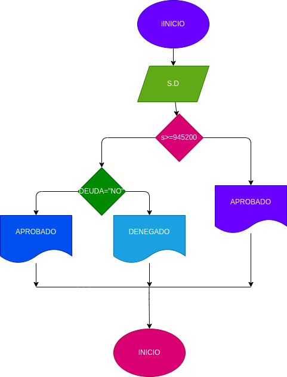

# Ejercicio N.2
## programa para ver si usted puede adqurir un prestamo bancario segun su salario y si tiene deudas

# ANALISIS

variables de entrada

salario = el dinero necesesario para adquirir el prestamo
deuda = saber si tiene deudas anteriores

variables de proceso
salario >= numero ingresado
deudas = si o no tienes deudas

variables de salida

aceptado = su prestamo fue aceptado
denegado = su prestamo fue denegado
nos indica si se acepta o se denego su prestamo

# DISEÑO

# Construccion