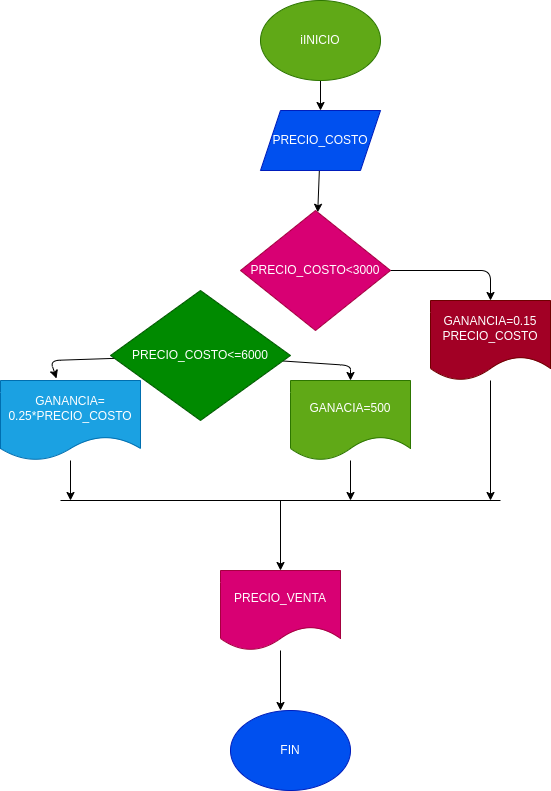

# Ejercicio N.3

## precio en una papeleria
programa para saber el precio adecuado de venta e una papeleria de diferentes productos segun su precio

# ANALISIS

variables de entrada

PRECIO_COSTO = la variable del precio al que compramos el producto

variables de proceso

GANANCIA =  es el precio de costo por el porcentaje necesesario de acuerdo al precio
PRECIO_VENTA = (GANANCIA + PRECIO_COSTO)

variables de salida

PRECIO VENTA = es el precio obtimo para vender el producto

# DISEÑO

# CONSTRUCCION