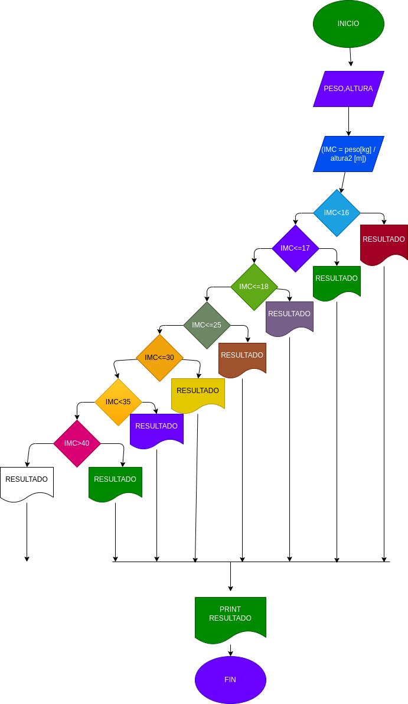

## MASA CORPORAL
programa para saber su masa corporal de acuerdo a su peso y altura
# ANALISIS

variables de entrada

PESO = su peso ingresado
ALTURA = sualtur ingresada

variables de proceso

RESULTADOS = son los resultados de su indice de peso

variables  de salida
IMC Y RESULTADOS = suelta si indice de peso y el resultado de estos

# DISEÑO

