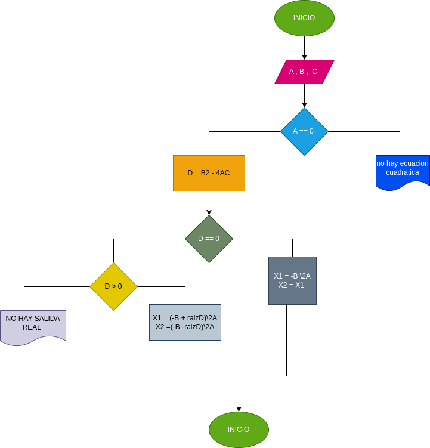

#raíces de ecuacion de segundo grado programa para Calcular e imprimir las raíces de la ecuación de segundo grado de coeficientes reales

#ANÁLISIS
Variables de entrada A = variable de número 1 B = variable de número 2 C = variable de número 3

variables de proceso C = variable en la que se hace la operacion para saber si son numeros reales posibles

Variables de salida X1 = la 1 variables de salida de los 3 casos X2 = la 2 variable de salida de los 3 casos

#DISEÑO

#CONSTRUCCION