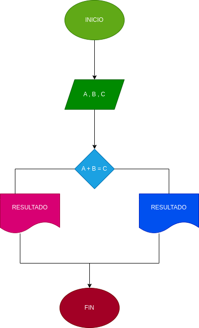

#Programa para saber si el numero 1 y 2 es igual al numero 3

#ANÁLISIS
Variables de entrada

A = 1 número B = 2 número C = 3 número

variables de proceso y salida

A + B = C : la suma de los 2 primeros números del 3

#DISEÑO
